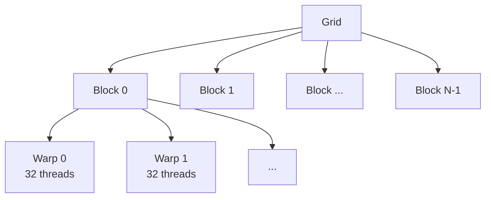

# CUDA Threading Basics

Before diving into Hybridizer, we need a solid understanding of GPU programming in CUDA. This chapter presents key concepts like blocks and threads, and compares CPU and GPU architectures to understand Hybridizer's approach to work distribution and vectorization inference.

## CUDA Architecture Overview

NVIDIA GPUs are made of **Streaming Multiprocessors (SM)**, each containing what NVIDIA calls "CUDA cores".

:::info
CUDA cores are **not** like CPU cores. They cannot operate independently — they run the same instruction on different data. They are more like SIMD lanes on a CPU.
:::

### Mental Model

| GPU Concept | CPU Equivalent |
|-------------|----------------|
| Streaming Multiprocessor (SM) | CPU Core |
| CUDA Core | SIMD Lane (AVX element) |
| Warp (32 threads) | Vector Register |
| Shared Memory | L1 Cache / Stack |

## Thread Hierarchy

CUDA threading has a hierarchical structure:



### Key Properties

- **Threads** are grouped in **blocks**
- **Blocks** are grouped in a **grid**
- Grids and blocks can have 1D, 2D, or 3D shape
- One block runs on a single SM
- Threads within a block can synchronize and share memory


## Built-in Variables

Inside a CUDA kernel (or Hybridizer entry point), you have access to:

| Variable | Type | Description |
|----------|------|-------------|
| `threadIdx` | dim3 | Thread index within block (0 to blockDim-1) |
| `blockIdx` | dim3 | Block index within grid (0 to gridDim-1) |
| `blockDim` | dim3 | Number of threads per block |
| `gridDim` | dim3 | Number of blocks in grid |

### Computing Global Thread ID

The standard pattern to compute a unique global thread ID:

```csharp
int globalId = threadIdx.x + blockIdx.x * blockDim.x;
```

For 2D grids:
```csharp
int x = threadIdx.x + blockIdx.x * blockDim.x;
int y = threadIdx.y + blockIdx.y * blockDim.y;
```

## Warps: The Execution Unit

A **warp** is a group of 32 threads that execute in lockstep (SIMT):

- All threads in a warp execute the same instruction
- Divergent branches cause serialization
- Memory accesses are coalesced when consecutive threads access consecutive addresses

:::tip
For best performance, avoid branch divergence within warps and ensure coalesced memory access.
:::

## Mapping to Hybridizer

In Hybridizer:

| Hybridizer | CUDA | Purpose |
|------------|------|---------|
| `[EntryPoint]` | `__global__` | Kernel launched from host |
| `[Kernel]` | `__device__` | Function called from device |
| `threadIdx.x` | `threadIdx.x` | Thread index |
| `blockIdx.x` | `blockIdx.x` | Block index |

The same code works on all platforms — Hybridizer maps these concepts appropriately:

| Platform | Block → | Thread → |
|----------|---------|----------|
| CUDA | CUDA block | CUDA thread |
| OMP | OpenMP thread | Loop iteration |
| AVX | Loop iteration | Vector lane |

## Next Steps

- [CUDA Functions](./functions) — Writing device code
- [Memory & Profiling](./memory-and-profiling) — GPU memory hierarchy
- [Core Concepts](../guide/concepts) — Hybridizer work distribution
