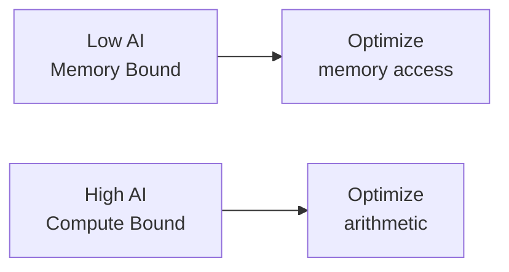

# Performance Metrics

Understanding performance metrics is essential for optimizing Hybridizer-generated kernels. This chapter covers key metrics and how to use them for tuning.

## Key Metrics Overview

| Metric | Description | Target |
|--------|-------------|--------|
| **Occupancy** | Ratio of active warps to max warps | > 50% |
| **SM Utilization** | How busy the SMs are | > 80% |
| **Memory Bandwidth** | Data transfer rate | > 70% of peak |
| **Compute Throughput** | Operations per second | Depends on workload |

## Occupancy

**Occupancy** = Active Warps / Maximum Warps per SM

Factors limiting occupancy:

| Factor | Impact |
|--------|--------|
| Registers per thread | More registers → fewer threads |
| Shared memory per block | More shared mem → fewer blocks |
| Block size | Suboptimal size → wasted slots |

### Checking Occupancy

```csharp
// Get device properties
cudaDeviceProp prop;
cuda.GetDeviceProperties(out prop, 0);

// Calculate occupancy
int maxThreadsPerSM = prop.maxThreadsPerMultiProcessor;
int threadsPerBlock = 256;
int blocksPerSM = maxThreadsPerSM / threadsPerBlock;

Console.WriteLine($"Theoretical occupancy: {blocksPerSM * threadsPerBlock * 100.0 / maxThreadsPerSM}%");
```

## Memory Throughput

### Bandwidth Calculation

```
Effective Bandwidth = (Bytes Read + Bytes Written) / Time
```

### Peak Bandwidth by GPU

| GPU | Memory | Peak Bandwidth |
|-----|--------|----------------|
| GTX 1080 Ti | GDDR5X | 484 GB/s |
| RTX 3090 | GDDR6X | 936 GB/s |
| A100 | HBM2e | 2039 GB/s |
| H100 | HBM3 | 3350 GB/s |

### Achieved vs Peak

| Achieved % | Assessment |
|------------|------------|
| > 80% | Excellent (memory bound is optimal) |
| 50-80% | Good |
| 25-50% | Room for improvement |
| < 25% | Investigate access patterns |

## Roofline Model

The roofline model helps identify whether your kernel is:
- **Compute bound**: Limited by arithmetic operations
- **Memory bound**: Limited by data transfer

```
Arithmetic Intensity = FLOPs / Bytes Transferred
```



### Practical Guidelines

| Arithmetic Intensity | Bound | Optimization Focus |
|---------------------|-------|-------------------|
| < 5 FLOP/byte | Memory | Coalescence, caching |
| 5-20 FLOP/byte | Transitional | Both |
| > 20 FLOP/byte | Compute | Instruction-level optimization |

## SM Utilization

SM utilization indicates how often SMs are actively executing:

| Utilization | Interpretation |
|-------------|----------------|
| > 90% | Optimal |
| 70-90% | Good |
| < 70% | Insufficient parallelism |

### Common Causes of Low Utilization

1. **Not enough blocks**: Increase grid size
2. **Synchronization barriers**: Reduce sync points
3. **Memory stalls**: Improve access patterns
4. **Branch divergence**: Reorganize conditionals

## Tuning Checklist

### 1. Launch Configuration

```csharp
// Get optimal block size
int blockSize = 256; // Good default
int gridSize = (N + blockSize - 1) / blockSize;

// Ensure enough blocks to saturate GPU
gridSize = Math.Max(gridSize, prop.multiProcessorCount * 8);

wrapper.SetDistrib(gridSize, blockSize);
```

### 2. Memory Access

- [ ] Coalesced global memory access
- [ ] Minimize global memory transactions
- [ ] Use shared memory for data reuse
- [ ] Align data to 128 bytes

### 3. Compute

- [ ] Minimize register usage if occupancy-limited
- [ ] Use fast math when accuracy permits
- [ ] Avoid warp divergence
- [ ] Unroll small loops

### 4. Data Transfer

- [ ] Minimize host-device transfers
- [ ] Use pinned memory
- [ ] Overlap compute and transfer with streams
- [ ] Keep data on GPU between kernels

## Profiling Commands

```bash
# Using Nsight Compute (modern)
ncu --set full ./my_program

# Using nvprof (legacy)
nvprof --metrics achieved_occupancy,gld_efficiency ./my_program

# Key metrics to check
# - achieved_occupancy
# - sm_efficiency  
# - gld_throughput / gst_throughput
# - dram_utilization
```

## Next Steps

- [Memory & Profiling](./memory-and-profiling) — Detailed profiling examples
- [Optimize Kernels](../howto/optimize-kernels) — Practical optimization guide
- [CUDA Functions](./functions) — Writing efficient device code
