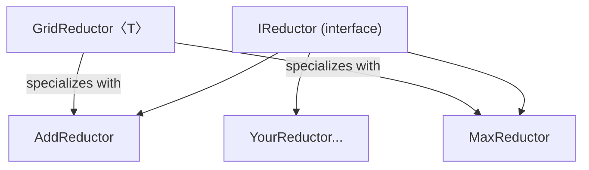

# Generic Reduction

> **Sample source**: [`6.Advanced/GenericReduction`](https://github.com/hybridizer-io/hybridizer-basic-samples/tree/master/src/6.Advanced/GenericReduction)

This example demonstrates how to write **reusable GPU algorithms** using Hybridizer generics. A single reduction kernel works for addition, maximum, or any user-defined operation — with **zero performance overhead** thanks to C++ template specialization.

## The Pattern



## Step 1: Define the Concept Interface

```csharp
[HybridTemplateConcept]
interface IReductor
{
    [Kernel] float func(float x, float y);
    [Kernel] float neutral { get; }
    [Kernel] float atomic(ref float target, float val);
}
```

`[HybridTemplateConcept]` tells Hybridizer this interface is a **template parameter constraint** — not a virtual dispatch table.

## Step 2: Implement Concrete Reductors

```csharp
struct AddReductor : IReductor
{
    [Kernel] public float neutral => 0.0f;
    [Kernel] public float func(float x, float y) => x + y;
    [Kernel] public float atomic(ref float target, float val)
        => Atomics.Add(ref target, val);
}

struct MaxReductor : IReductor
{
    [Kernel] public float neutral => float.MinValue;
    [Kernel] public float func(float x, float y) => Math.Max(x, y);
    [Kernel] public float atomic(ref float target, float val)
        => Atomics.Max(ref target, val);
}
```

:::info
Reductors are `struct`, not `class`. This is essential — structs get inlined by the C++ compiler, while classes would introduce virtual dispatch.
:::

## Step 3: Write the Generic Algorithm

```csharp
[HybridRegisterTemplate(Specialize = typeof(GridReductor<MaxReductor>))]
[HybridRegisterTemplate(Specialize = typeof(GridReductor<AddReductor>))]
class GridReductor<TReductor> where TReductor : struct, IReductor
{
    [Kernel]
    TReductor reductor => default(TReductor);

    [Kernel]
    public void Reduce(float[] result, float[] input, int N)
    {
        var cache = new SharedMemoryAllocator<float>().allocate(blockDim.x);
        int tid = threadIdx.x + blockDim.x * blockIdx.x;
        int cacheIndex = threadIdx.x;

        float tmp = reductor.neutral;
        while (tid < N)
        {
            tmp = reductor.func(tmp, input[tid]);
            tid += blockDim.x * gridDim.x;
        }

        cache[cacheIndex] = tmp;
        CUDAIntrinsics.__syncthreads();

        int i = blockDim.x / 2;
        while (i != 0)
        {
            if (cacheIndex < i)
                cache[cacheIndex] = reductor.func(cache[cacheIndex], cache[cacheIndex + i]);
            CUDAIntrinsics.__syncthreads();
            i >>= 1;
        }

        if (cacheIndex == 0)
            reductor.atomic(ref result[0], cache[0]);
    }
}
```

### Attribute Explanation

| Attribute | Purpose |
|-----------|---------|
| `[HybridTemplateConcept]` | Interface → C++ template constraint |
| `[HybridRegisterTemplate]` | Register a specialization for code generation |
| `[Kernel]` | Mark as device-side code |

## Step 4: Entry Points

Hybridizer doesn't support generic entry points (marshalling requires concrete types). Wrap calls in specialized methods:

```csharp
class EntryPoints
{
    [EntryPoint]
    public static void ReduceAdd(
        GridReductor<AddReductor> reductor,
        [Out] float[] result, [In] float[] input, int N)
    {
        reductor.Reduce(result, input, N);
    }

    [EntryPoint]
    public static void ReduceMax(
        GridReductor<MaxReductor> reductor,
        [Out] float[] result, [In] float[] input, int N)
    {
        reductor.Reduce(result, input, N);
    }
}
```

## Launch and Verify

```csharp
cuda.GetDeviceProperties(out cudaDeviceProp prop, 0);
int gridDimX = 16 * prop.multiProcessorCount;
int blockDimX = 256;

cuda.DeviceSetCacheConfig(cudaFuncCache.cudaFuncCachePreferShared);

HybRunner runner = SatelliteLoader.Load()
    .SetDistrib(gridDimX, 1, blockDimX, 1, 1, blockDimX * sizeof(float));

dynamic wrapped = runner.Wrap(new EntryPoints());

// Reduce
wrapped.ReduceMax(new GridReductor<MaxReductor>(), buffMax, a, N);
wrapped.ReduceAdd(new GridReductor<AddReductor>(), buffAdd, a, N);
cuda.ERROR_CHECK(cuda.DeviceSynchronize());
```

## Performance: Generics vs Virtual vs Plain

Based on benchmarks on a GeForce 1080 Ti (peak: 355 GB/s):

| Approach | Bandwidth | % of Peak |
|----------|-----------|-----------|
| **Plain code** | 328 GB/s | 92% |
| **Generics (templates)** | 328 GB/s | **92%** |
| Virtual functions | 154 GB/s | 43% |
| Runtime lambdas | 59 GB/s | 17% |

:::tip
**Generics recover full performance** because they are compiled to C++ templates. The concrete type is known at compile time, enabling full inlining.
:::

## Next Steps

- [Lambda Reduction](./lambda-reduction) — Alternative using delegates
- [Generics, Virtuals, Delegates](../guide/generics-virtuals-delegates) — Detailed guide
- [Reduction](./reduction) — Simpler non-generic version
