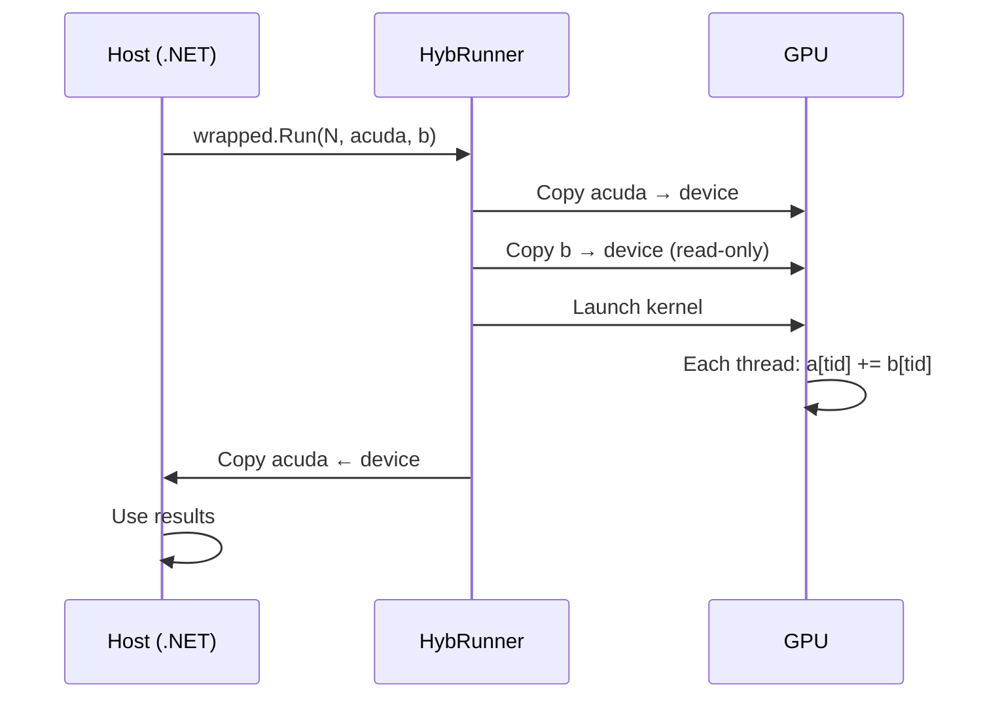

# Hello World: Vector Addition

> **Sample source**: [`1.Simple/HelloWorld`](https://github.com/hybridizer-io/hybridizer-basic-samples/tree/master/src/1.Simple/HelloWorld)

This is the simplest possible Hybridizer program: add two `double` arrays together. The same C# code runs both on the CPU (.NET) and on the GPU (CUDA).

## The Code

```csharp
using Hybridizer.Runtime.CUDAImports;
using System.Threading.Tasks;

class Program
{
    [EntryPoint]
    public static void Run(int N, double[] a, [In] double[] b)
    {
        Parallel.For(0, N, i => { a[i] += b[i]; });
    }
}
```

### Key observations

| Element | Purpose |
|---------|---------|
| `[EntryPoint]` | Tells Hybridizer to compile this method for GPU |
| `Parallel.For` | Hybridizer maps this to a CUDA grid-stride loop |
| `[In]` on `b` | Declares `b` as read-only — saves a device-to-host copy |
| No `[In]`/`[Out]` on `a` | `a` is both read and written — gets copied both ways |

## Launching on GPU

```csharp
static void Main(string[] args)
{
    int N = 1024 * 1024 * 16;
    double[] acuda   = new double[N];
    double[] adotnet = new double[N];
    double[] b       = new double[N];

    // Initialize data…
    Random rand = new();
    for (int i = 0; i < N; ++i)
    {
        acuda[i] = rand.NextDouble();
        adotnet[i] = acuda[i];
        b[i] = rand.NextDouble();
    }

    // Setup GPU wrapper
    cuda.GetDeviceProperties(out cudaDeviceProp prop, 0);
    HybRunner runner = SatelliteLoader.Load()
        .SetDistrib(prop.multiProcessorCount * 16, 128);
    dynamic wrapped = runner.Wrap(new Program());

    // Run on GPU
    wrapped.Run(N, acuda, b);
    cuda.ERROR_CHECK(cuda.DeviceSynchronize());

    // Run on CPU for comparison
    Run(N, adotnet, b);

    // Verify
    for (int k = 0; k < N; ++k)
    {
        if (acuda[k] != adotnet[k]) {
            Console.WriteLine("ERROR!");
            return;
        }
    }
    Console.WriteLine("DONE");
}
```

## How It Works



### Grid-stride loop expansion

When Hybridizer sees `Parallel.For(0, N, i => ...)`, it generates a CUDA kernel equivalent to:

```cpp
__global__ void Run(int N, double* a, const double* b)
{
    for (int i = threadIdx.x + blockIdx.x * blockDim.x;
         i < N;
         i += blockDim.x * gridDim.x)
    {
        a[i] += b[i];
    }
}
```

## The `[In]` / `[Out]` Attributes

These `System.Runtime.InteropServices` attributes control data transfer direction:

| Attribute | Transfer | Use When |
|-----------|----------|----------|
| (none) | Host ↔ Device (both ways) | Array is read and written |
| `[In]` | Host → Device only | Array is read-only on device |
| `[Out]` | Device → Host only | Array is write-only on device |

:::tip
Using `[In]` and `[Out]` correctly can **halve your memory transfer time**. See the [`InOut` sample](https://github.com/hybridizer-io/hybridizer-basic-samples/tree/master/src/1.Simple/InOut) for a benchmark.
:::

## Next Steps

- [Mandelbrot](./mandelbrot) — 2D kernels with `[Kernel]` helper functions
- [Reduction](./reduction) — Shared memory and synchronization
- [Black-Scholes](./black-scholes) — Real-world finance application
