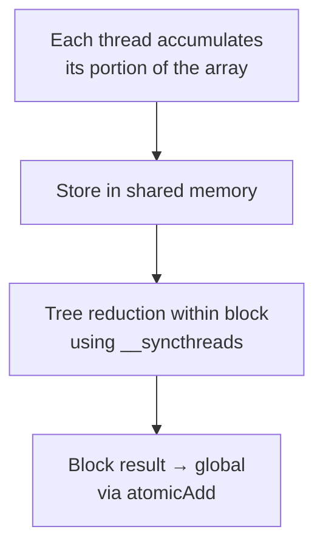

# Parallel Reduction

> **Sample source**: [`1.Simple/Reduction`](https://github.com/hybridizer-io/hybridizer-basic-samples/tree/master/src/1.Simple/Reduction)

Reduction (computing a single result from an array — sum, max, min…) is a fundamental GPU pattern. This sample shows shared memory, thread synchronization, and atomic operations in Hybridizer.

## The Algorithm



## Reduction Kernel

```csharp
[EntryPoint]
public static void ReduceAdd(int N, [In] int[] a, [Out] int[] result)
{
    // 1. Allocate shared memory for the block
    var cache = new SharedMemoryAllocator<int>().allocate(blockDim.x);
    int tid = threadIdx.x + blockDim.x * blockIdx.x;
    int cacheIndex = threadIdx.x;

    // 2. Grid-stride accumulation
    int tmp = 0;
    while (tid < N)
    {
        tmp += a[tid];
        tid += blockDim.x * gridDim.x;
    }
    cache[cacheIndex] = tmp;

    // 3. Synchronize — all threads must finish before tree reduction
    CUDAIntrinsics.__syncthreads();

    // 4. Tree reduction in shared memory
    int i = blockDim.x / 2;
    while (i != 0)
    {
        if (cacheIndex < i)
        {
            cache[cacheIndex] += cache[cacheIndex + i];
        }
        CUDAIntrinsics.__syncthreads();
        i >>= 1;
    }

    // 5. Thread 0 writes block result to global output
    if (cacheIndex == 0)
    {
        Interlocked.Add(ref result[0], cache[0]);
    }
}
```

## Key Concepts Demonstrated

### 1. Shared Memory

```csharp
var cache = new SharedMemoryAllocator<int>().allocate(blockDim.x);
```

- `SharedMemoryAllocator<T>` maps to CUDA `__shared__` memory
- Allocated per block (not per thread)
- ~100× faster than global memory
- On CPU, falls back to stack allocation

### 2. Thread Synchronization

```csharp
CUDAIntrinsics.__syncthreads();
```

- Barrier: all threads in the block must reach this point before any can proceed
- Essential for shared memory correctness
- On CPU, this is a no-op (sequential)

### 3. Atomic Operations

```csharp
Interlocked.Add(ref result[0], cache[0]);
```

- Maps to CUDA `atomicAdd` on GPU
- Thread-safe accumulation across blocks
- Uses `System.Threading.Interlocked` — standard .NET API

## Launch Configuration

Shared memory size must be specified explicitly:

```csharp
const int BLOCK_DIM = 256;

cuda.GetDeviceProperties(out cudaDeviceProp prop, 0);
HybRunner runner = SatelliteLoader.Load()
    .SetDistrib(
        16 * prop.multiProcessorCount, 1,   // gridDim
        BLOCK_DIM, 1, 1,                    // blockDim
        BLOCK_DIM * sizeof(int)             // shared memory bytes
    );
```

:::warning
The last parameter to `SetDistrib` is the **dynamic shared memory size** in bytes. Without it, the shared memory allocation will fail silently.
:::

## Verification

The sample compares GPU and LINQ results:

```csharp
wrapped.ReduceAdd(N, a, result);
cuda.DeviceSynchronize();

int expected = a.Aggregate((i, j) => i + j);
Console.WriteLine($"GPU sum = {result[0]}");
Console.WriteLine($"Expected = {expected}");
```

## Next Steps

- [Generic Reduction](./generic-reduction) — Reusable reduction with generics
- [Lambda Reduction](./lambda-reduction) — Using delegates and lambdas
- [Optimize Kernels](../howto/optimize-kernels) — Performance tuning
