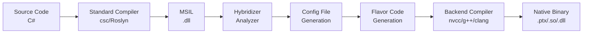

# Compilation Pipeline

The code transformation for defined flavors involves several steps. This chapter describes the processing phases and configuration options.


## Pipeline Overview



## Step 1: Input Generation

The user compiles code using standard tools:

| Source Language | Compiler | Output |
|-----------------|----------|--------|
| C# | csc / Roslyn | .NET assembly (.dll) |
| F# | fsc | .NET assembly |

## Step 2: Build Parameters

Several parameters control how source code for a given flavor is generated. The base configuration file (`hybridizer.base.config`) is generated using an MSBuild build task.

### MSBuild Task Example

```xml
<?xml version="1.0" encoding="utf-8"?>
<Project DefaultTargets="Build" xmlns="http://schemas.microsoft.com/developer/msbuild/2003" ToolsVersion="4.0">
  <PropertyGroup>
    <HybridizerBuildTask>{HybridizerPath}\Hybridizer.VSIntegration.BuildSatelliteTask.dll</HybridizerBuildTask>
    <HybridizerBinaryPath>{HybridizerPath}\Hybridizer.exe</HybridizerBinaryPath>
    <Platform>x64</Platform>
  </PropertyGroup>
  <UsingTask AssemblyFile="$(HybridizerBuildTask)" 
      TaskName="Hybridizer.VSIntegration.BuildSatelliteTask.BuildSatelliteTask" />
  <Target Name="Build">
    <MakeDir Directories="generated-sources"/>
    <BuildSatelliteTask
      DllFullPath="MyProject.dll"
      ResultFileName="MyProject.CUDA.xml"
      GenerateLineInformation="true"
      WorkingDirectory="generated-sources"
      Flavors="CUDA" />
  </Target>
</Project>
```

## Step 3: Configuration File

The configuration file holds all functions to be transformed, including:
- **EntryPoints**: Methods called from host
- **Kernels**: Device-side methods

### Configuration File Structure

```xml
<?xml version="1.0" encoding="utf-8"?>
<HybridizerMetaConfigFile>
  <ConfigFile 
      DllFullPath="MyApp.exe" 
      PdbFullPath="MyApp.pdb" 
      GenerateLineInformation="true" 
      UseFunctionPointers="true">
    
    <HybridFlavor 
       FlavorName="CUDA" 
       GenerateCWrapper="true" 
       BuiltInFileNames="hybridizer.c.builtins;" />
    
    <HybridElements HybridType="MyClass">
      <HybridizedMethod MethodName="Algorithm">
        <ParameterTypes>
          <string>System.Double</string>
        </ParameterTypes>
      </HybridizedMethod>
    </HybridElements>
    
  </ConfigFile>
</HybridizerMetaConfigFile>
```

### Key Configuration Options

| Option | Description |
|--------|-------------|
| `GenerateLineInformation` | Include debug line mappings |
| `UseFunctionPointers` | Enable function pointer support |
| `GenerateHiddenStubs` | Generate stubs for internal methods |
| `DelegateSupport` | Enable delegate transformation |
| `UseHybridArrays` | Use Hybridizer array types |

## Step 4: Flavor Code Generation

Based on the configuration file, the Hybridizer generates source code for the selected flavor:

| Flavor | Output Files | Compiler |
|--------|-------------|----------|
| CUDA | `.cu`, `.cuh` | nvcc |
| OMP | `.cpp`, `.h` | g++ -fopenmp |
| AVX | `.cpp`, `.h` | g++ -mavx |

Each source file includes a sub-configuration comment for reproducibility.

## Hybridizer Community Edition Integration

:::tip
Hybridizer Community Edition wraps all these steps in its Visual Studio integration, providing a seamless build experience.
:::

## Supported Inputs

### MSIL (.NET)

The Hybridizer operates on Microsoft Intermediate Language in binary form (.NET assembly). With associated attributes, the assembly is processed, extracting methods that need to be transformed.


## Next Steps

- [Invoke Generated Code](./invoke-generated-code) — Call kernels from host
- [Generated Code Layout](./generated-code-layout) — Understand output structure
- [Line Info & Debug](./line-info-and-debug) — Debugging support
