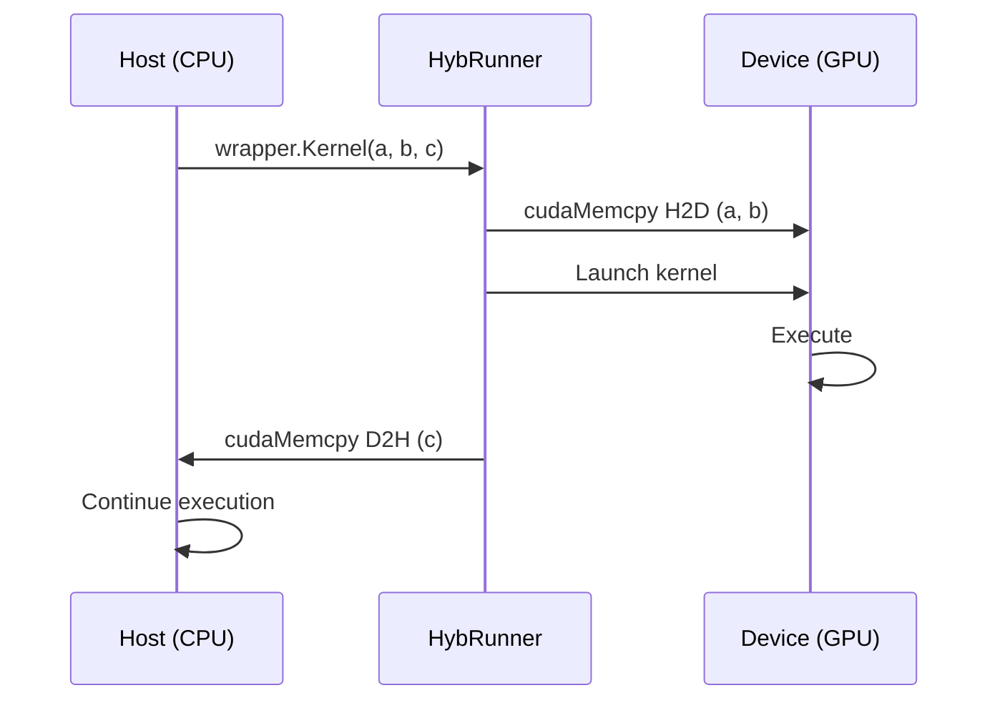

# Data Marshalling

Data marshalling describes how data is transferred between the host (CPU) and the device (GPU or accelerator). Understanding marshalling is crucial for achieving good performance.

## Default Marshalling Rules

### Arrays

Arrays are the most common data type in kernel code:

| Array Type | Default Behavior |
|------------|------------------|
| `float[]`, `double[]` | Copied to device, copied back |
| `int[]`, `long[]` | Copied to device, copied back |
| Struct arrays | Copied element-by-element |

```csharp
[EntryPoint]
public static void Process(float[] input, float[] output, int n)
{
    // input and output are automatically:
    // 1. Copied to device before kernel launch
    // 2. Kernel executes
    // 3. Copied back to host after kernel completes
}
```

### Structs

Structs are marshalled inline (by value):

```csharp
public struct Vector3
{
    public float X, Y, Z;
}

[EntryPoint]
public static void Transform(Vector3[] points, int n)
{
    // Vector3[] is marshalled as contiguous memory
}
```

:::info
Only blittable structs are supported. Structs containing references (strings, objects) cannot be marshalled.
:::

## Memory Transfer Diagram



## Pinned vs Copied Memory

### Pageable Memory (Default)

Standard .NET arrays use pageable memory:
- Data is copied to a staging buffer
- Then copied to device memory
- Safe but slower

### Pinned Memory

For better performance, use pinned (page-locked) memory:

```csharp
// Allocate pinned memory
IntPtr pinnedPtr = cuda.MallocHost(size);
float[] pinnedArray = /* wrap pinnedPtr */;

// Use with kernel - no copy needed!
wrapper.Kernel(pinnedArray, output, n);

// Free when done
cuda.FreeHost(pinnedPtr);
```

Benefits of pinned memory:
- **Faster transfers**: Direct DMA access
- **Async copies possible**: Overlap compute and transfer
- **Lower latency**: No intermediate staging

## Async Copies and Streams

For maximum performance, overlap data transfer with computation:

```csharp
// Create streams
cudaStream_t stream1, stream2;
cuda.StreamCreate(out stream1);
cuda.StreamCreate(out stream2);

// Async operations
cuda.MemcpyAsync(d_a, h_a, size, cudaMemcpyHostToDevice, stream1);
wrapper.SetStream(stream1).Kernel(d_a, d_b, n);
cuda.MemcpyAsync(h_b, d_b, size, cudaMemcpyDeviceToHost, stream1);

// Synchronize when needed
cuda.StreamSynchronize(stream1);
```

## Ownership and Lifetimes

| Scenario | Ownership |
|----------|-----------|
| Kernel parameter | Runtime manages transfer |
| Manual allocation | User manages lifetime |
| Pinned memory | User must free |

:::danger
Do not modify host arrays while a kernel is running asynchronously. This can cause undefined behavior.
:::

## Advanced: Custom Marshalling

For complex scenarios, you can implement custom marshalling:

```csharp
[StructLayout(LayoutKind.Sequential)]
public struct CustomData
{
    public IntPtr DataPointer;
    public int Length;
    
    // Custom marshalling logic
}
```

## Performance Tips

| Tip | Impact |
|-----|--------|
| Minimize transfers | High |
| Use pinned memory | Medium-High |
| Batch small transfers | Medium |
| Use async copies | Medium |
| Keep data on device | High |

:::tip
The best transfer is no transfer at all. Keep data on the device between kernel calls when possible.
:::

## Next Steps

- [Invoke Generated Code](./invoke-generated-code) — Launch configuration
- [Memory & Profiling](../cuda/memory-and-profiling) — CUDA memory optimization
- [Manage Memory](../howto/manage-memory) — Best practices
