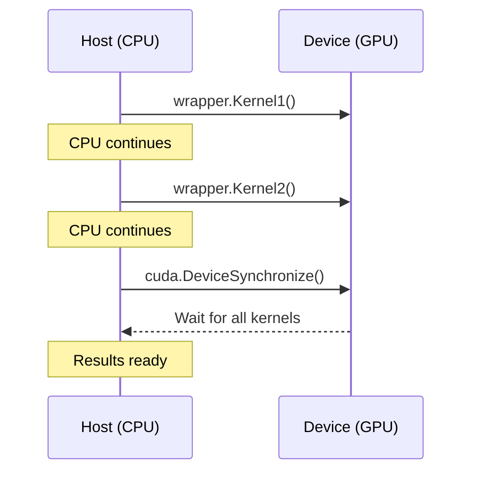

# Invoke Generated Code

This chapter explains how to load and invoke Hybridizer-generated kernels from your host application.

## Using HybRunner

The `HybRunner` class is the primary interface for invoking generated code:

```csharp
using Hybridizer.Runtime.CUDAImports;

// Create a runner for CUDA
dynamic wrapper = HybRunner.Cuda();

// Configure launch parameters
wrapper.SetDistrib(gridSize, blockSize);

// Invoke the kernel
wrapper.MyKernel(param1, param2, param3);
```

## Launch Configuration

### Grid and Block Dimensions

CUDA kernels require a launch configuration specifying how many blocks and threads to use:

```csharp
// Get device properties for optimal configuration
cudaDeviceProp prop;
cuda.GetDeviceProperties(out prop, 0);

// Common patterns
int blockSize = 256;  // Threads per block
int gridSize = prop.multiProcessorCount * 16;  // Blocks

wrapper.SetDistrib(gridSize, blockSize);
```

### Configuration Guidelines

| Workload Size | Recommended Configuration |
|---------------|---------------------------|
| Small (< 10K) | 32 blocks × 128 threads |
| Medium (10K-1M) | SM count × 8 × 256 threads |
| Large (> 1M) | SM count × 16 × 256 threads |

:::tip
Use enough threads to saturate the GPU. A good rule of thumb is at least 10,000 threads for modern GPUs.
:::

## Stream Management

Streams allow overlapping computation and data transfer:

```csharp
// Create a stream
cudaStream_t stream;
cuda.StreamCreate(out stream);

// Associate stream with runner
wrapper.SetStream(stream);

// Kernel runs asynchronously
wrapper.MyKernel(a, b, c);

// Do other work on CPU...

// Wait for completion
cuda.StreamSynchronize(stream);

// Cleanup
cuda.StreamDestroy(stream);
```

### Multiple Streams

```csharp
cudaStream_t[] streams = new cudaStream_t[4];
for (int i = 0; i < 4; i++)
{
    cuda.StreamCreate(out streams[i]);
}

// Launch kernels on different streams
for (int i = 0; i < 4; i++)
{
    wrapper.SetStream(streams[i]);
    wrapper.ProcessChunk(data, i * chunkSize, chunkSize);
}

// Wait for all
for (int i = 0; i < 4; i++)
{
    cuda.StreamSynchronize(streams[i]);
}
```

## Error Handling

Always check for errors after kernel invocation:

```csharp
// Launch kernel
wrapper.MyKernel(a, b, n);

// Check for launch errors
cudaError_t launchError = cuda.GetLastError();
if (launchError != cudaError_t.cudaSuccess)
{
    Console.WriteLine($"Launch error: {cuda.GetErrorString(launchError)}");
}

// Synchronize and check for execution errors
cudaError_t syncError = cuda.DeviceSynchronize();
if (syncError != cudaError_t.cudaSuccess)
{
    Console.WriteLine($"Execution error: {cuda.GetErrorString(syncError)}");
}
```

### Common Errors

| Error | Cause | Solution |
|-------|-------|----------|
| `cudaErrorInvalidConfiguration` | Bad grid/block size | Check dimensions |
| `cudaErrorLaunchOutOfResources` | Too many threads | Reduce block size |
| `cudaErrorIllegalAddress` | Out-of-bounds access | Check array indices |

## Synchronization Points



### When to Synchronize

| Scenario | Synchronization |
|----------|-----------------|
| Read results | Required |
| Between dependent kernels | Usually automatic |
| Timing measurements | Required |
| Error checking | Recommended |

## OMP and AVX Invocation

For non-CUDA backends, the invocation is similar:

```csharp
// OMP backend
dynamic ompWrapper = HybRunner.OMP();
ompWrapper.SetDistrib(Environment.ProcessorCount, 1);
ompWrapper.MyKernel(a, b, c);

// AVX backend
dynamic avxWrapper = HybRunner.AVX();
avxWrapper.MyKernel(a, b, c);
```

## Next Steps

- [Data Marshalling](./data-marshalling) — Memory transfer details
- [Line Info & Debug](./line-info-and-debug) — Debugging kernels
- [CUDA Backend](../platforms/cuda) — CUDA-specific features
