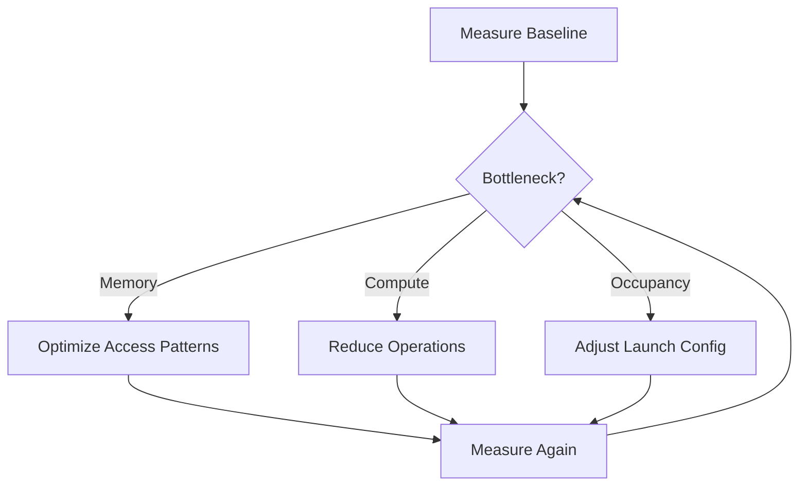

# Optimize Kernels

This guide provides practical techniques for optimizing Hybridizer-generated kernels for maximum performance.

## Optimization Workflow



## 1. Launch Configuration

### Block Size Selection

```csharp
// Common block sizes
int blockSize = 256;  // Good default for most kernels

// For compute-heavy kernels
int blockSize = 128;  // More registers available per thread

// For memory-heavy kernels
int blockSize = 512;  // More threads to hide latency
```

### Grid Size Calculation

```csharp
cudaDeviceProp prop;
cuda.GetDeviceProperties(out prop, 0);

// Ensure enough blocks to saturate GPU
int minBlocks = prop.multiProcessorCount * 8;
int gridSize = Math.Max(
    (N + blockSize - 1) / blockSize,
    minBlocks
);

wrapper.SetDistrib(gridSize, blockSize);
```

## 2. Memory Access Optimization

### Ensure Coalescence

**Good** (coalesced):
```csharp
// Consecutive threads access consecutive addresses
int i = threadIdx.x + blockIdx.x * blockDim.x;
data[i] = value;  // ✅ Coalesced
```

**Bad** (strided):
```csharp
// Threads access with stride
int i = threadIdx.x * stride + blockIdx.x;
data[i] = value;  // ❌ Not coalesced
```

### Structure of Arrays (SoA)

```csharp
// Bad: Array of Structures (AoS)
struct Particle { float x, y, z; }
Particle[] particles;  // ❌ Poor memory access

// Good: Structure of Arrays (SoA)
float[] x, y, z;  // ✅ Coalesced access per component
```

### Use Shared Memory

```csharp
[EntryPoint]
public static void WithSharedMemory(float[] input, float[] output, int N)
{
    // Declare shared memory
    HybridArray<float> shared = new HybridArray<float>(blockDim.x, HybridArrayFlags.Shared);
    
    int tid = threadIdx.x;
    int i = threadIdx.x + blockIdx.x * blockDim.x;
    
    // Load to shared memory
    if (i < N)
        shared[tid] = input[i];
    
    CUDAIntrinsics.SyncThreads();
    
    // Work with shared memory (fast access)
    // ...
    
    // Write result
    if (i < N)
        output[i] = shared[tid];
}
```

## 3. Reduce Divergence

### Avoid Divergent Branches

**Bad** (divergent within warp):
```csharp
if (threadIdx.x % 2 == 0)
    DoSomething();  // Half threads idle
else
    DoOther();  // Other half idle
```

**Better** (uniform per warp):
```csharp
if (blockIdx.x % 2 == 0)
    DoSomething();  // All threads in block do same
else
    DoOther();
```

### Loop Unrolling

```csharp
// Compiler hint for unrolling
[Kernel]
public static float Sum4(float[] data, int start)
{
    // Manual unroll for small known counts
    return data[start] + data[start+1] + data[start+2] + data[start+3];
}
```

## 4. Use Fast Math

When precision permits:

```csharp
// Standard precision
double result = Math.Sin(x) * Math.Exp(y);

// Fast approximations (GPU intrinsics)
float result = FastMath.sinf(x) * FastMath.expf(y);
```

## 5. Minimize Synchronization

```csharp
// Bad: Sync after every operation
for (int step = 0; step < N; step++)
{
    shared[tid] = compute();
    CUDAIntrinsics.SyncThreads();  // ❌ Too many syncs
}

// Better: Batch work between syncs
for (int step = 0; step < N; step += 4)
{
    // Do 4 steps of work
    shared[tid] = compute4Steps();
    CUDAIntrinsics.SyncThreads();  // ✅ Fewer syncs
}
```

## Optimization Checklist

| Category | Check | Impact |
|----------|-------|--------|
| Launch | Block size 128-512 | Medium |
| Launch | Grid saturates SMs | High |
| Memory | Coalesced access | High |
| Memory | Shared mem for reuse | Medium |
| Compute | Minimize divergence | Medium |
| Compute | Fast math where ok | Low |
| Sync | Minimize barriers | Medium |

## Profiling Commands

```bash
# Check occupancy
ncu --metrics sm__warps_active.avg.pct_of_peak_sustained_active ./app

# Check memory efficiency
ncu --metrics l1tex__t_bytes_pipe_lsu_mem_global_op_ld.sum.per_second ./app

# Full analysis
ncu --set full -o profile ./app
```

## Next Steps

- [Performance Metrics](../cuda/perf-metrics) — Understanding metrics
- [Memory & Profiling](../cuda/memory-and-profiling) — Profiling tools
- [Manage Memory](./manage-memory) — Memory best practices
