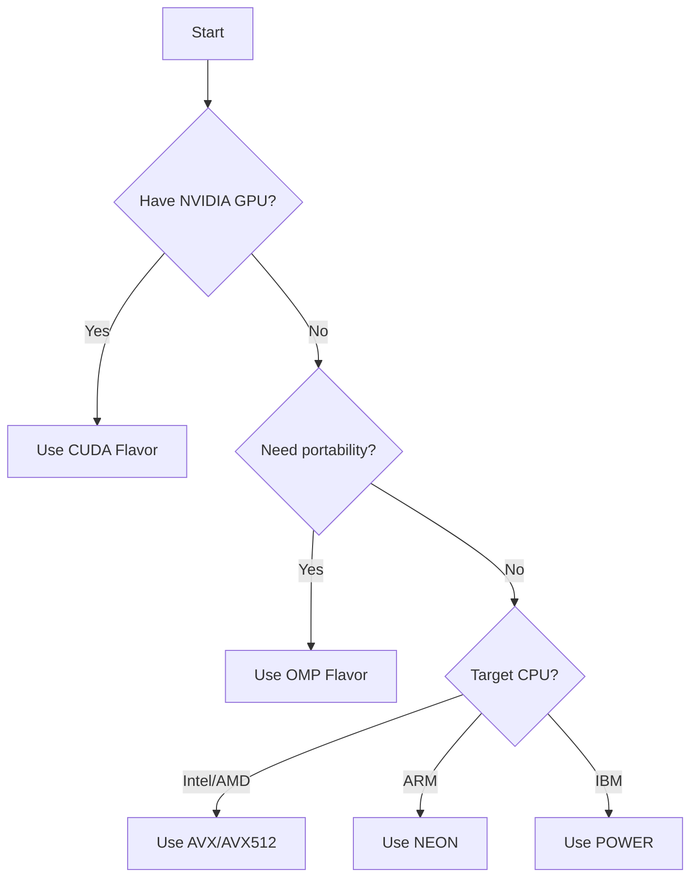

# Platforms & Flavors Overview

The numerous outputs of the Hybridizer are called **Flavors**. Flavors define the language or jargon in which the Hybridizer outputs code. This output is then compiled using the appropriate compiler to generate machine code for the target architecture.

## Available Flavors

| Flavor | Target | Compiler | Best For |
|--------|--------|----------|----------|
| **CUDA** | NVIDIA GPUs | nvcc | Massive parallel throughput |
| **OMP** | Multi-core CPUs | gcc/clang with OpenMP | Portability, debugging |
| **AVX** | Intel/AMD CPUs | gcc/clang | High-perf CPU SIMD |
| **AVX512** | Intel Xeon/HPC | gcc/clang | Wide vector operations |
| **NEON** | ARM processors | gcc/clang | Embedded, mobile |
| **POWER** | IBM POWER | xlc/gcc | HPC systems |

## Choosing a Flavor

## Flavor Details

### CUDA Flavor
For NVIDIA GPUs. Generates `.cu` files with `__device__` and `__global__` attributes. Best for massive parallel throughput.

→ [CUDA Backend Details](./cuda)

### OMP Flavor
Plain C/C++ with OpenMP support. Useful for:
- **Testing**: Disambiguating issues between input code and flavor source-code generation
- **Portability**: Sequential fallback if compiled without OpenMP
- **Performance**: Optimizing compilers may generate better machine code than the JIT

→ [OMP Backend Details](./omp-cuda)

### Vector Flavors (AVX/NEON/POWER)
C++ code using a micro-library for vectorization. The implementation is specific to each hardware architecture, but the interface is common.

→ [Vector Backends Details](./vector-avx-neon)

## Next Steps

- [CUDA Backend](./cuda) — Deep dive into GPU targeting
- [OMP Backend](./omp-cuda) — CPU multi-threading
- [Vector Backends](./vector-avx-neon) — SIMD on CPU
