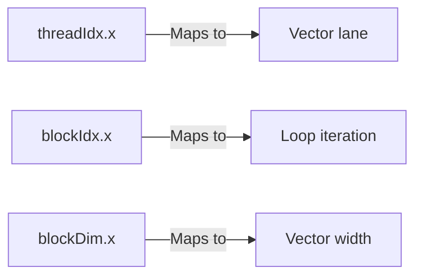

# Vector Backends (AVX/NEON/POWER)

For hardware where a general-purpose C/C++ compiler like g++ is available, the Hybridizer generates C++ code using a **micro-library for vectorization**. The implementation of this micro-library is specific to each hardware architecture, but its general interface is common.

## Available Vector Flavors

| Flavor | Target | Vector Width | Registers |
|--------|--------|--------------|-----------|
| **AVX** | Intel/AMD (2011+) | 256 bits | 4 double / 8 float |
| **AVX2** | Intel/AMD (2013+) | 256 bits | + integer ops |
| **AVX512** | Intel Xeon/HPC | 512 bits | 8 double / 16 float |
| **NEON** | ARM processors | 128 bits | 2 double / 4 float |
| **POWER (VSX)** | IBM POWER | 128 bits | 2 double / 4 float |

## How It Works

The Hybridizer maps CUDA concepts to vector operations:



### CUDA to AVX Mapping

| CUDA Concept | AVX Equivalent |
|--------------|----------------|
| Thread | Vector lane (0-3 for double, 0-7 for float) |
| Block | Loop iteration |
| Warp (32 threads) | Multiple vector operations |
| Shared memory | Stack allocation (cache-resident) |

## Example: Vector Square

C# source code:

```csharp
[EntryPoint]
public void Square(int count, double[] a, double[] b)
{
    for (int k = threadIdx.x + blockDim.x * blockIdx.x; 
         k < count; 
         k += blockDim.x * gridDim.x)
    {
        b[k] = a[k] * a[k];
    }
}
```

Generated AVX code (conceptual):

```cpp
for (int block = 0; block < gridDim; block++)
{
    __m256d a_vec = _mm256_load_pd(&a[block * 4]);
    __m256d result = _mm256_mul_pd(a_vec, a_vec);
    _mm256_store_pd(&b[block * 4], result);
}
```

## AVX Flavor

Implements a micro-library using **AVX intrinsics**. A compilation flag allows usage of AVX 2.0 if available.

### Requirements
- Intel Sandy Bridge or AMD Bulldozer (2011+)
- GCC 4.4+, Clang 3.0+, or MSVC 2010+

### Build
```bash
g++ -mavx -O3 -o program program.cpp
# Or for AVX2:
g++ -mavx2 -O3 -o program program.cpp
```

## AVX512 Flavor

Implements a micro-library using **MIC micro-architecture instructions** with 512-bit wide vector registers.

### Requirements
- Intel Xeon Phi, Skylake-X, or newer
- GCC 4.9+, Clang 3.9+

### Build
```bash
g++ -mavx512f -O3 -o program program.cpp
```

## NEON Flavor

Implements a micro-library using **NEON micro-architecture instructions**, available on ARM processors.

### Requirements
- ARMv7 with NEON or ARMv8 (NEON is mandatory)
- GCC or Clang for ARM

### Build
```bash
aarch64-linux-gnu-g++ -O3 -o program program.cpp
```

## POWER Flavor (VSX)

Implements a micro-library using **VSX micro-architecture instructions** for IBM POWER processors.

### Requirements
- IBM POWER7 or newer
- xlc or gcc for POWER

### Build
```bash
xlc++ -O3 -qaltivec -o program program.cpp
```

## Performance Considerations

:::info
Vector width, alignment, and memory layout significantly impact performance.
:::

| Consideration | Recommendation |
|---------------|----------------|
| **Alignment** | Align data to vector width (32 bytes for AVX) |
| **Memory layout** | Use Structure of Arrays (SoA) over AoS |
| **Vector width** | Match loop iterations to vector width |
| **Cache** | Keep working set in L1/L2 cache |

## When to Use Vector Backends

| Scenario | Recommendation |
|----------|----------------|
| No GPU available | ✅ Excellent choice |
| Low-latency requirements | ✅ Lower overhead than GPU |
| CPU-bound workloads | ✅ Ideal |
| Massive parallelism (millions of threads) | ❌ Use CUDA |
| Embedded/mobile (ARM) | ✅ Use NEON |

## Next Steps

- [CUDA Backend](./cuda) — For GPU acceleration
- [OMP Backend](./omp-cuda) — For multi-threading
- [Optimize Kernels](../howto/optimize-kernels) — Performance tuning
