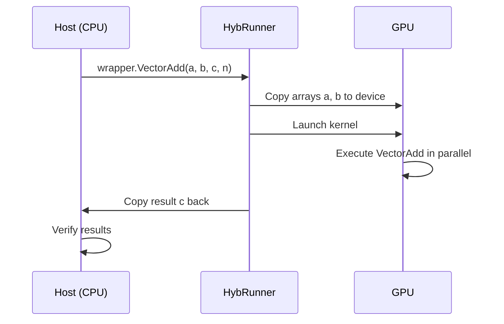

# Your First Kernel: Hello GPU!

Let's run your first piece of accelerated code. This simple example adds two vectors together — a classic parallel computing task that demonstrates the power of GPU acceleration.

## What You'll Learn

- How to mark a method as an entry point
- How to use work distribution with `threadIdx` and `blockIdx`
- How to invoke generated code from your host application

## Prerequisites

- Hybridizer installed ([Installation Guide](./install))
- NVIDIA GPU with CUDA support
- Visual Studio with C# support

## The Complete Example

### Step 1: Create Your Project

Create a new C# Console Application and add the Hybridizer NuGet packages:

```bash
dotnet add package Hybridizer.Runtime.CUDAImports
```

### Step 2: Write Your Kernel

```csharp
using System;
using Hybridizer.Runtime.CUDAImports;

namespace HelloGPU
{
    class Program
    {
        // Mark this method as a GPU entry point
        [EntryPoint]
        public static void VectorAdd(float[] a, float[] b, float[] c, int n)
        {
            // Work distribution using CUDA concepts
            for (int i = threadIdx.x + blockDim.x * blockIdx.x; 
                 i < n; 
                 i += blockDim.x * gridDim.x)
            {
                c[i] = a[i] + b[i];
            }
        }

        static void Main(string[] args)
        {
            const int N = 1024 * 1024; // 1 million elements
            
            // Allocate arrays
            float[] a = new float[N];
            float[] b = new float[N];
            float[] c = new float[N];
            
            // Initialize with test data
            for (int i = 0; i < N; i++)
            {
                a[i] = i;
                b[i] = 2 * i;
            }

            // Get GPU properties for optimal configuration
            cudaDeviceProp prop;
            cuda.GetDeviceProperties(out prop, 0);
            
            // Create the Hybridizer runner
            // Configure: (number of blocks, threads per block)
            dynamic wrapper = HybRunner.Cuda()
                .SetDistrib(prop.multiProcessorCount * 16, 256);
            
            // Run on GPU!
            wrapper.VectorAdd(a, b, c, N);
            
            // Verify results
            bool success = true;
            for (int i = 0; i < N; i++)
            {
                float expected = a[i] + b[i];
                if (Math.Abs(c[i] - expected) > 1e-5f)
                {
                    Console.WriteLine($"Mismatch at {i}: {c[i]} != {expected}");
                    success = false;
                    break;
                }
            }
            
            Console.WriteLine(success ? "SUCCESS!" : "FAILED");
        }
    }
}
```

## Understanding the Code

### The Entry Point

```csharp
[EntryPoint]
public static void VectorAdd(float[] a, float[] b, float[] c, int n)
```

The `[EntryPoint]` attribute tells Hybridizer to generate a CUDA `__global__` kernel from this method.

### Work Distribution Pattern

```csharp
for (int i = threadIdx.x + blockDim.x * blockIdx.x; 
     i < n; 
     i += blockDim.x * gridDim.x)
```

This is the standard **grid-stride loop** pattern:
- `threadIdx.x`: Thread index within a block (0 to blockDim.x-1)
- `blockIdx.x`: Block index within the grid
- `blockDim.x`: Number of threads per block
- `gridDim.x`: Number of blocks in the grid


### Kernel Launch Configuration

```csharp
wrapper.SetDistrib(prop.multiProcessorCount * 16, 256);
```

- **First parameter**: Number of blocks (typically `SM count × 16` for good occupancy)
- **Second parameter**: Threads per block (typically 128, 256, or 512)

## Build and Run

1. Build the solution in Visual Studio (Debug or Release)
2. The Hybridizer will automatically:
   - Generate CUDA source code
   - Compile with nvcc
   - Link the resulting binary
3. Run the executable

## Expected Output

```
SUCCESS!
```

## What Happens Under the Hood



## Common Issues

| Issue | Solution |
|-------|----------|
| "CUDA device not found" | Check NVIDIA driver installation |
| "nvcc not found" | Add CUDA Toolkit to PATH |
| Wrong results | Verify array sizes match kernel expectations |

## Next Steps

- [Run and Debug](./run-and-debug) — Debugging GPU code
- [Core Concepts](../guide/concepts) — Understand work distribution
- [CUDA Backend](../platforms/cuda) — Deep dive into CUDA features
