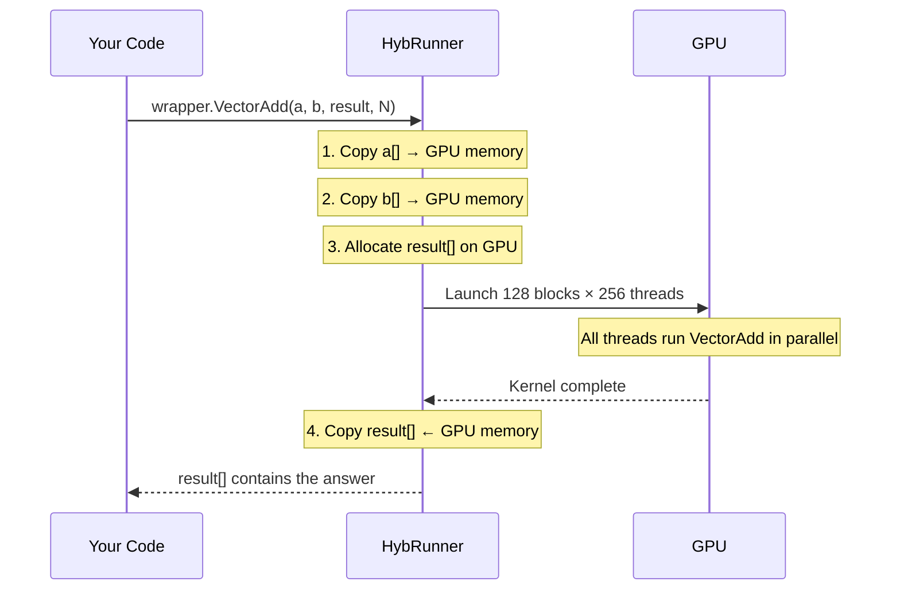

# Your First Kernel

In this tutorial, you'll write a program that adds two arrays together — first on the CPU, then on the GPU. You'll see the **exact same C# code** run on both.

## Start with Plain C#

Here's how every C# developer would add two arrays:

```csharp
static void VectorAdd(float[] a, float[] b, float[] result, int N)
{
    for (int i = 0; i < N; i++)
    {
        result[i] = a[i] + b[i];
    }
}
```

This runs on **one CPU core**, one element at a time. Let's make it parallel.

## Step 1: Add `[EntryPoint]`

One attribute transforms this into GPU-capable code:

```csharp
using Hybridizer.Runtime.CUDAImports;

class Program
{
    // highlight-next-line
    [EntryPoint]
    public static void VectorAdd(float[] a, float[] b, float[] result, int N)
    {
        for (int i = threadIdx.x + blockDim.x * blockIdx.x;
             i < N;
             i += blockDim.x * gridDim.x)
        {
            result[i] = a[i] + b[i];
        }
    }
}
```

### What changed?

| Before (CPU) | After (GPU) |
|-------------|-------------|
| `for (int i = 0; i < N; i++)` | `for (int i = threadIdx.x + blockDim.x * blockIdx.x; i < N; i += blockDim.x * gridDim.x)` |
| One thread does everything | Thousands of threads share the work |

Think of it like this:
- **CPU**: One person reads a book from page 1 to page 1000
- **GPU**: 1000 people each read one page simultaneously

### The Grid-Stride Loop

```
threadIdx.x + blockDim.x * blockIdx.x
```

This computes a unique ID for each thread. With 256 threads per block and 32 blocks:

```
Thread 0 in Block 0 → i = 0
Thread 1 in Block 0 → i = 1
...
Thread 0 in Block 1 → i = 256
Thread 0 in Block 2 → i = 512
```

The stride `blockDim.x * gridDim.x` handles arrays larger than the total thread count.

## Step 2: Launch It

```csharp
static void Main()
{
    const int N = 1_000_000;

    // Prepare data
    float[] a = new float[N];
    float[] b = new float[N];
    float[] result = new float[N];

    for (int i = 0; i < N; i++)
    {
        a[i] = i;
        b[i] = i * 0.5f;
    }

    // Create GPU wrapper
    dynamic wrapper = HybRunner.Cuda().SetDistrib(128, 256);

    // Run on GPU!
    wrapper.VectorAdd(a, b, result, N);
    cuda.DeviceSynchronize();

    // Check results
    Console.WriteLine($"result[0] = {result[0]}");       // 0 + 0 = 0
    Console.WriteLine($"result[42] = {result[42]}");     // 42 + 21 = 63
    Console.WriteLine($"result[999999] = {result[999999]}");
}
```

### Understanding `SetDistrib(128, 256)`

```csharp
HybRunner.Cuda().SetDistrib(128, 256);
//                           │    │
//                           │    └─ 256 threads per block
//                           └─ 128 blocks in the grid
```

Total threads: 128 × 256 = **32,768** threads working in parallel.

:::info
For 1 million elements with 32K threads, each thread processes about 30 elements via the grid-stride loop. That's the point of the `i += blockDim.x * gridDim.x` stride.
:::

## Step 3: What Happens Behind the Scenes



Hybridizer handles all memory transfers automatically. You just call the method.

## Step 4: Verify GPU == CPU

Always compare GPU results with a CPU reference:

```csharp
// GPU
wrapper.VectorAdd(a, b, gpuResult, N);
cuda.DeviceSynchronize();

// CPU (same code, direct call)
VectorAdd(a, b, cpuResult, N);

// Compare
int errors = 0;
for (int i = 0; i < N; i++)
{
    if (Math.Abs(gpuResult[i] - cpuResult[i]) > 1e-5f)
        errors++;
}
Console.WriteLine(errors == 0 ? "✅ GPU matches CPU" : $"❌ {errors} mismatches");
```

:::tip
The `[EntryPoint]` method is **valid C# code**. You can always call it directly for a CPU reference. On CPU, `threadIdx.x` = 0, `blockIdx.x` = 0, `blockDim.x` = 1, `gridDim.x` = 1 — so the loop behaves like a regular `for(i=0; i<N; i++)`.
:::

## Exercise

Modify the kernel to compute `result[i] = a[i] * b[i] + 1.0f` (fused multiply-add). Verify GPU == CPU.

## Next

How do you debug this? What is Hybridizer actually generating? → [Understanding the Result →](./understanding-result)
