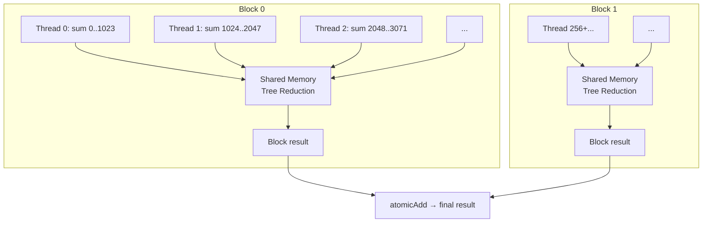

# Shared Memory & Reduction

The **reduction** — computing a single value from a large array (sum, max, min…) — is the most instructive GPU pattern. It teaches you the three GPU-specific concepts you'll use throughout your Hybridizer career:

1. **Shared memory** — fast per-block storage
2. **Thread synchronization** — `__syncthreads`
3. **Atomic operations** — safe cross-block communication

> **Full sample**: [`1.Simple/Reduction`](https://github.com/hybridizer-io/hybridizer-basic-samples/tree/master/src/1.Simple/Reduction)

## The Problem

Sum 32 million integers. On CPU:

```csharp
int sum = 0;
for (int i = 0; i < N; i++)
    sum += a[i];
```

Simple, but sequential. On GPU, we need to **divide and conquer**.

## The Strategy

```
Step 1: Each thread sums its portion of the array
Step 2: Threads in the same block combine their results (shared memory)
Step 3: Each block writes its result to global memory (atomic)
```



## The Kernel

```csharp
[EntryPoint]
public static void ReduceAdd(int N, [In] int[] a, [Out] int[] result)
{
    // 1️⃣ Allocate shared memory for this block
    var cache = new SharedMemoryAllocator<int>().allocate(blockDim.x);

    int tid = threadIdx.x + blockDim.x * blockIdx.x;
    int cacheIndex = threadIdx.x;

    // 2️⃣ Each thread accumulates its portion
    int tmp = 0;
    while (tid < N)
    {
        tmp += a[tid];
        tid += blockDim.x * gridDim.x;  // grid-stride
    }

    // Store in shared memory
    cache[cacheIndex] = tmp;

    // 3️⃣ Synchronize — wait for ALL threads in this block
    CUDAIntrinsics.__syncthreads();

    // 4️⃣ Tree reduction within shared memory
    int i = blockDim.x / 2;
    while (i != 0)
    {
        if (cacheIndex < i)
        {
            cache[cacheIndex] += cache[cacheIndex + i];
        }
        CUDAIntrinsics.__syncthreads();
        i >>= 1;
    }

    // 5️⃣ Thread 0 writes this block's result
    if (cacheIndex == 0)
    {
        Interlocked.Add(ref result[0], cache[0]);
    }
}
```

Let's understand each part.

## Part 1: Shared Memory

```csharp
var cache = new SharedMemoryAllocator<int>().allocate(blockDim.x);
```

**What is shared memory?**
- A small (48-96 KB), very fast memory **shared by all threads in a block**
- ~100× faster than global memory
- Think of it as a programmer-controlled L1 cache

| Memory Type | Speed | Scope | Size |
|------------|-------|-------|------|
| Registers | Fastest | One thread | ~255 per thread |
| **Shared** | **Very fast** | **One block** | **48-96 KB** |
| Global | Slow | All threads | GBs |

On CPU (.NET), `SharedMemoryAllocator<T>` falls back to a regular array.

## Part 2: Grid-Stride Accumulation

```csharp
int tmp = 0;
while (tid < N)
{
    tmp += a[tid];
    tid += blockDim.x * gridDim.x;
}
cache[cacheIndex] = tmp;
```

Each thread walks the array with a stride equal to the total thread count. With 256 threads × 128 blocks = 32K threads:
- Thread 0 sums elements 0, 32768, 65536, ...
- Thread 1 sums elements 1, 32769, 65537, ...

Each thread's result goes into shared memory.

## Part 3: `__syncthreads`

```csharp
CUDAIntrinsics.__syncthreads();
```

**This is a barrier.** It means: "all 256 threads in this block must reach this line before any can continue."

Without it, Thread 0 might start reading `cache[128]` before Thread 128 has written to it → **data race**.

:::warning
Every thread in the block **must** call `__syncthreads()`. Putting it inside an `if` block where some threads skip it causes a **deadlock**.
:::

## Part 4: Tree Reduction

```csharp
int i = blockDim.x / 2;   // i = 128
while (i != 0)
{
    if (cacheIndex < i)
        cache[cacheIndex] += cache[cacheIndex + i];
    CUDAIntrinsics.__syncthreads();
    i >>= 1;               // i = 64, 32, 16, 8, 4, 2, 1
}
```

This combines 256 values into 1 in just **8 steps** (log₂ 256):

```
Step 1: 256 values → 128 (threads 0-127 each add their partner)
Step 2: 128 values → 64
Step 3: 64 → 32
Step 4: 32 → 16
Step 5: 16 → 8
Step 6: 8 → 4
Step 7: 4 → 2
Step 8: 2 → 1   ← final result in cache[0]
```

## Part 5: Atomic Add

```csharp
if (cacheIndex == 0)
    Interlocked.Add(ref result[0], cache[0]);
```

Each block produces one partial sum. `Interlocked.Add` safely accumulates them:
- Maps to `atomicAdd` on GPU
- Thread-safe (hardware-guaranteed)
- Standard .NET API (`System.Threading.Interlocked`)

## Launching the Kernel

Shared memory size must be declared explicitly:

```csharp
const int BLOCK_DIM = 256;

cuda.GetDeviceProperties(out cudaDeviceProp prop, 0);
dynamic wrapper = HybRunner.Cuda()
    .SetDistrib(
        16 * prop.multiProcessorCount, 1,   // grid: many blocks
        BLOCK_DIM, 1, 1,                    // block: 256 threads
        BLOCK_DIM * sizeof(int)             // shared memory: 1 KB
    );

int[] result = new int[1];
wrapper.ReduceAdd(N, a, result);
cuda.DeviceSynchronize();
```

The last parameter (`BLOCK_DIM * sizeof(int)`) tells CUDA how much shared memory to allocate per block.

## Verification

```csharp
int expected = a.Aggregate((x, y) => x + y);
Console.WriteLine($"GPU:      {result[0]}");
Console.WriteLine($"Expected: {expected}");
```

## Recap

| Concept | Hybridizer API | CUDA Equivalent | Purpose |
|---------|---------------|-----------------|---------|
| Shared memory | `SharedMemoryAllocator<T>` | `__shared__` | Fast per-block storage |
| Barrier sync | `CUDAIntrinsics.__syncthreads()` | `__syncthreads()` | Wait for all threads |
| Atomic ops | `Interlocked.Add` | `atomicAdd` | Safe cross-block writes |

## What's Next

Congratulations — you've completed the tutorial series! You now understand:

1. ✅ Installation and setup
2. ✅ Writing kernels with `[EntryPoint]`
3. ✅ Debugging, `[In]`/`[Out]`, profiling
4. ✅ Porting CPU code to GPU
5. ✅ 2D image processing
6. ✅ Shared memory and cooperative patterns

Where to go from here:

- **[Examples](../examples/hello-world)** — Browse 9 complete working samples
- **[Generics & Performance](../guide/generics-virtuals-delegates)** — Write reusable, zero-cost GPU code
- **[Optimization Guide](../howto/optimize-kernels)** — Squeeze every drop of performance
- **[Black-Scholes](../examples/black-scholes)** — A real finance application
